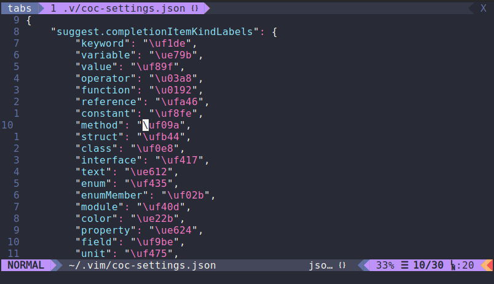

# Aline

Align text with a single simple command.

Aline is an alternative to [Tabular](https://github.com/godlygeek/tabular), but
with simpler commands.

Let Aline find where to start and end aligning



Or specify the range yourself


Different alignments are supported


Align removing extra spaces


Aline auto updates the alignment when text is changed


## Features

* Simple usage, no complex regex patterns like in [Tabular](https://github.com/godlygeek/tabular)
* No dependencies, works with only Vimscript
* Format using any separator
* Auto reformat modified text
* Python 3 aligning option

## Installation

Add this to your [VimPlug](https://github.com/junegunn/vim-plug) configuration:

```vim
call plug#begin()
...
Plug 'vinicius-toshiyuki/aline.git'
...
call plug#end()
````

Exit Vim and run

```bash
vim +PlugInstall +qa
```

## Usage

There is no built-in documentation inside Vim yet.

The main command is `:[<range>]Aline <sep> [<options>]` with the cursor inside
the block of text to be formatted.

* `<range>` is the line range
  * Using a range implies `n` in the options
* `<sep>` is the separator
  * Can be more than one character
  * Spaces and `\` must be escaped
* `<options>` can be an alignment , `c` for clearing extra white spaces, `k` for
keeping spaces at start of line, a padding added to the separator, `n` to
disable update in this area.
  * `-`, `=`, `+` : left, center and right alignment, respectively
  * With `c` and a padding, spaces are cleared before inserting padding
  * `k` has no effect if `c` is not used
  * Options may be in any order
  * Do not include white spaces between options

There is also `:AlineEnableUpdate` and `:AlineDisableUpdate` for enabling and
disabling auto update for a file.
Auto update uses `CursorHold` and `CursorHoldI` events to refresh, change the
refresh interval with `set updatetime=300` or some other time in milliseconds
(default is `4000`).

## Customization

These variables can be set in your configuration file to change Aline's behavior:

* `g:aline#use_python3` (default=`v:false`): use Python 3 to align text
* `g:aline#max_line_count` (default=`100`): max text block line size to keep
auto updating when modified
* `g:aline#separator_padding` (default=`0`): white space padding added to the separator
* `g:aline#default_alignment` (default=`-`): alignment used if none was provided
* `g:aline#update#file_types` (default=`[]`): list of file extensions to enable
auto update automatically on opening a file

### Performance

While processing the text can be very quick, when used to format a block of text
too long it might take a few seconds for Vim to fetch the text and replace it
with the new one.
For this reason, auto update is disabled for long texts (`g:aline#max_line_count`).

## Author

[Vinícius T M Sugimoto](https://github.com/vinicius-toshiyuki)

## License

MIT License.
